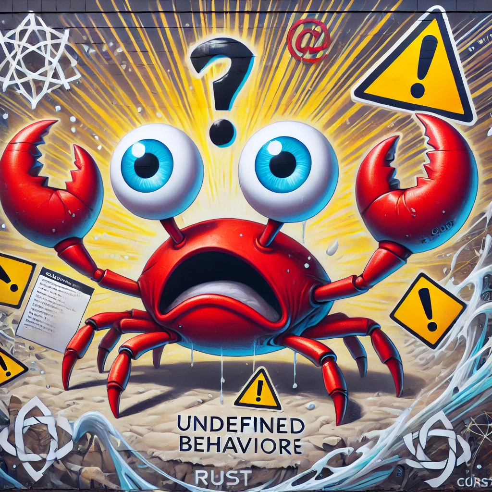
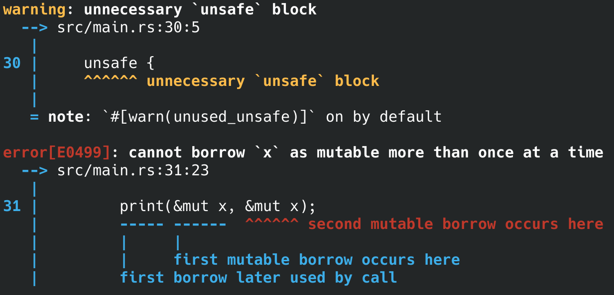

---
# You can also start simply with 'default'
theme: seriph
# some information about your slides (markdown enabled)
title: Unsafe Rust
info: |
  ## Slidev Starter Template
  Presentation slides for developers.

  Learn more at [Sli.dev](https://sli.dev)
# apply unocss classes to the current slide
class: text-center
# https://sli.dev/features/drawing
drawings:
  persist: false
# slide transition: https://sli.dev/guide/animations.html#slide-transitions
transition: slide-left
# enable MDC Syntax: https://sli.dev/features/mdc
mdc: true
# take snapshot for each slide in the overview
overviewSnapshots: true
---

# Unsafe Rust

"You seem confident... let's see where this goes!" — the compiler.

<div class="abs-br m-6 flex gap-2">
  <a href="https://github.com/zarix908" target="_blank" alt="GitHub" title="Open in GitHub"
    class="text-xl slidev-icon-btn opacity-50 !border-none !hover:text-white">
    <carbon-logo-github />
  </a>
</div>

<!--
The last comment block of each slide will be treated as slide notes. It will be visible and editable in Presenter Mode along with the slide. [Read more in the docs](https://sli.dev/guide/syntax.html#notes)
-->

---
transition: fade-out
---

<dev style="display: flex; justify-content: center;">
  <dev>
    
  </dev>
</dev>

---
transition: fade-out
---

# Undefined Behavior & Aliasing & Optimization

---
transition: fade-out
---

# Undefined Behavior

```c++
#include <iostream>
using namespace std;

void print(int* __restrict__ a, int* __restrict__ b) {
    *a = 9;
    *b = 10;
    cout << *a << endl;
}

int main() {
    int x = 0;
    print(&x, &x);
}
```

---
transition: fade-out
---

# Undefined Behavior

```bash
~ ./main 
10
~ g++ -O3 -o main main.cpp
~ ./main 
9
~
```

---
transition: fade-out
---

# Undefined Behavior

```c++
#include <iostream>
using namespace std;

void print(int* __restrict__ a, int* __restrict__ b) {
    *a = 9;
    *b = 10;
    cout << *a << endl;
}

int main() {
    int x = 0;
    print(&x, &x);
}
```

  * UB is an undocumented way of executing code.
  * The language developers rely on contracts, the violation of which leads to undefined behavior (UB).
  * The presence of this contracts allow for more optimizations in the program.
  * Developers spend a lot of time and effort optimizing code, so they want to delegate this work to the compiler.

---
transition: fade-out
---

# Aliasing and Type Based Alias Analysis ([TBAA](https://www.cs.cornell.edu/courses/cs6120/2022sp/blog/type-alias/))

```c++
#include <iostream>
using namespace std;

void print(int* a, int* b) {
    *a = 9;
    *b = 10;
    cout << *a << endl;
}

int main() {
    int x = 0;
    print(&x, &x);
}
```

---
transition: fade-out
---

# Aliasing UB in Rust?

```rust
fn print(a: &mut i32, b: &mut i32) {
    *a = 9;
    *b = 10;
    println!("{}", *a);
}
```

---
transition: fade-out
---

# Aliasing UB in Rust?

```rust
fn print(a: &mut i32, b: &mut i32) {
    *a = 9;
    *b = 10;
    println!("{}", *a);
}

fn main() {
    let mut x = 0;
    print(&mut x, &mut x);
}
```

<dev>
  
</dev>

---
transition: fade-out
---

# References

```rust
fn mutate_local(v: Vec<i32>) -> Vec<i32> {
    let mut new_v = v;
    new_v.push(10);
    new_v 
}
```

```rust
fn mutate(c: &RefCell<Vec<i32>>) {
    c.borrow_mut().push(10);
}
```

  * `T` - owning
  * `&mut T` - ~~mutable~~ unique reference
  * `&T` - ~~immutable~~ shared reference

Compile-time analogues (not identical in behavior)

  * `T` - moving
  * `&mut T` - `unique_ptr<T>`
  * `&T` - `shared_ptr<T>`

---
transition: fade-out
---

# Reborrowing?

---
transition: fade-out
---

# Magic!

```rust
fn inc_all(nums: &mut [i32]) {
    thread::scope(|s| {
        for n in nums {
            s.spawn(|| {
                *n += 1
            });
        }
    });
}
```

---
transition: fade-out
---

# Unsafe

---
transition: fade-out
---

# Unsafe functionality

```rust
fn print(a: &mut i32, b: &mut i32) {
    *a = 9;
    *b = 10;
    println!("{}", *a);
}
fn unsafe_fn() {
    let mut x = 0;
    unsafe {
        print(&mut x, &mut x);
    }
}
```

<div>
  
</div>

---
transition: fade-out
---

# Unsafe functionality

Extra `unsafe` superpowers:

* Dereference a raw pointer
* Call an unsafe function or method
* Access or modify a mutable static variable
* Implement an unsafe trait
* Access fields of a union

---
transition: fade-out
---

# Dereference a raw pointer

  * raw pointers - `*const T`, `*mut T`
    ```rust
    let mut num = 1;
    let p1 = &num as *const i32;
    let p2 = &mut num as *mut i32;

    let address = 0x012345usize;
    let p = address as *const i32;
    ```
  * deref raw pointers
    ```rust
    let mut num = 6;

    let p1 = &num as *const i32;
    let p2 = &mut num as *mut i32;

    unsafe {
        println!("p1 is: {}", *p1);
        println!("p2 is: {}", *p2);
    }
    ```

---
transition: fade-out
---

# Call an unsafe function or method

```rust
pub const fn split_at_mut(&mut self, mid: usize) -> (&mut [T], &mut [T])

pub const fn split_at_mut_checked(&mut self, mid: usize) -> Option<(&mut [T], &mut [T])> {
    if mid <= self.len() {
        // SAFETY: `[ptr; mid]` and `[mid; len]` are inside `self`, which
        // fulfills the requirements of `split_at_unchecked`.
        Some(unsafe { self.split_at_mut_unchecked(mid) })
    } else {
        None
    }
}
```
---
transition: fade-out
---

# Access or modify a mutable static variable

```rust
static mut COUNTER: u32 = 0;

fn add_to_count(inc: u32) {
    unsafe {
        COUNTER += inc;
    }
}

fn main() {
    add_to_count(3);

    unsafe {
        println!("COUNTER: {COUNTER}");
    }
}
```

  * memory safety -> thread safety
  * lazy_static

---
transition: fade-out
---

# Implement an unsafe trait

```rust
pub unsafe auto trait Send
pub unsafe auto trait Sync
```

---
transition: fade-out
---

# Access fields of a union

```rust
#[repr(C)]
union MyUnion {
    f1: u32,
    f2: f32,
}
```

---
transition: fade-out
---

# UB [list](https://doc.rust-lang.org/reference/behavior-considered-undefined.html)

  * Data races.
  * Accessing (loading from or storing to) a place that is [dangling] or [based on
    a misaligned pointer].
  * Performing a place projection that violates the requirements of [in-bounds
    pointer arithmetic](pointer#method.offset). A place projection is a [field
    expression][project-field], a [tuple index expression][project-tuple], or an
    [array/slice index expression][project-slice].
  * Breaking the [pointer aliasing rules]. `Box<T>`, `&mut T` and `&T` follow
    LLVM’s scoped [noalias] model, except if the `&T` contains an
    [`UnsafeCell<U>`].
  * Calling a function with the wrong call ABI or unwinding from a function with the wrong unwind ABI.
  * Producing an [invalid value][invalid-values]. "Producing" a
    value happens any time a value is assigned to or read from a place, passed to
    a function/primitive operation or returned from a function/primitive
    operation.
  * **In [const context](const_eval.md#const-context)**: transmuting or otherwise
    reinterpreting a pointer (reference, raw pointer, or function pointer) into
    some allocated object as a non-pointer type (such as integers).

---
transition: fade-out
---

# Unsafe example

---
transition: fade-out
---

# Unsafe example ([split_at_mut_unchecked](https://github.com/rust-lang/rust/blob/master/library/core/src/slice/mod.rs#L2050))

```rust
pub const unsafe fn split_at_mut_unchecked(&mut self, mid: usize) -> (&mut [T], &mut [T]) {
    let len = self.len();
    let ptr = self.as_mut_ptr();

    assert_unsafe_precondition!(
        check_library_ub,
        "slice::split_at_mut_unchecked requires the index to be within the slice",
        (mid: usize = mid, len: usize = len) => mid <= len,
    );

    // SAFETY: Caller has to check that `0 <= mid <= self.len()`.
    //
    // `[ptr; mid]` and `[mid; len]` are not overlapping, so returning a mutable reference
    // is fine.
    unsafe {
        (
            from_raw_parts_mut(ptr, mid),
            from_raw_parts_mut(ptr.add(mid), unchecked_sub(len, mid)),
        )
    }
}
```

---
transition: fade-out
---

# Unsafe example (split_at_mut_unchecked)

```rust
pub const unsafe fn from_raw_parts_mut<'a, T>(data: *mut T, len: usize) -> &'a mut [T] {
    // SAFETY: the caller must uphold the safety contract for `from_raw_parts_mut`.
    unsafe {
        // ...
        &mut *ptr::slice_from_raw_parts_mut(data, len)
    }
}
```

---
transition: fade-out
---

# Magic?

```rust
fn inc_all(nums: &mut [i32]) {
    thread::scope(|s| {
        for n in nums {
            s.spawn(|| {
                *n += 1
            });
        }
    });
}
```

---
transition: fade-out
---

# Magic?

```rust
pub struct MyIterMut<'a, T: 'a>(&'a mut[T]);

impl<'a, T> Iterator for MyIterMut<'a, T> {
type Item = &'a mut T;
    fn next(&mut self) -> Option<&'a mut T> {
        let slice = std::mem::replace(&mut self.0, &mut []);

        if slice.is_empty() { 
            return None; 
        }

        let (l, r) = slice.split_at_mut(1);
        self.0 = r;
        l.get_mut(0)
    }
}
```
---
transition: fade-out
---

# Pin

---
transition: fade-out
---

# Pin (simple future)

```rust
let fut_one = /* ... */;
let fut_two = /* ... */;
async move {
    fut_one.await;
    fut_two.await;
}
```

<div>
  
</div>

---
transition: fade-out
---

# Pin (anonym future struct)

```rust
// The `Future` type generated by our `async { ... }` block
struct AsyncFuture {
    fut_one: FutOne,
    fut_two: FutTwo,
    state: State,
}

// List of states our `async` block can be in
enum State {
    AwaitingFutOne,
    AwaitingFutTwo,
    Done,
}
```

<div>
  
</div>

---
transition: fade-out
---

# Pin (impl future)

```rust
impl Future for AsyncFuture {
    type Output = ();

    fn poll(mut self: Pin<&mut Self>, cx: &mut Context<'_>) -> Poll<()> {
        loop {
            match self.state {
                State::AwaitingFutOne => match self.fut_one.poll(..) {
                    Poll::Ready(()) => self.state = State::AwaitingFutTwo,
                    Poll::Pending => return Poll::Pending,
                }
                State::AwaitingFutTwo => match self.fut_two.poll(..) {
                    Poll::Ready(()) => self.state = State::Done,
                    Poll::Pending => return Poll::Pending,
                }
                State::Done => return Poll::Ready(()),
            }
        }
    }
}
```

<div>
  
</div>

---
transition: fade-out
---

# Pin (future with ref)

```rust
async {
    let mut x = [0; 128];
    let read_into_buf_fut = read_into_buf(&mut x);
    read_into_buf_fut.await;
    println!("{:?}", x);
}
```

---
transition: fade-out
---

# Pin (state of future with ref)

```rust
struct ReadIntoBuf<'a> {
    buf: &'a mut [u8], // points to `x` below
}

struct AsyncFuture {
    x: [u8; 128],
    read_into_buf_fut: ReadIntoBuf<'what_lifetime?>,
}
```

---
transition: fade-out
---

# Pin (simple example)

```rust
struct Test {
    a: String,
    b: *const String,
}
```

---
transition: fade-out
---

# Pin (self-refferential)

```rust
impl Test {
    fn new(txt: &str) -> Self {
        Test {
            a: String::from(txt),
            b: std::ptr::null(),
        }
    }

    fn init(&mut self) {
        let self_ref: *const String = &self.a;
        self.b = self_ref;
    }

    fn a(&self) -> &str {
        &self.a
    }

    fn b(&self) -> &String {
        assert!(!self.b.is_null(), "Test::b called without Test::init being called first");
        unsafe { &*(self.b) }
    }
}
```

---
transition: fade-out
---

# Pin (test without move)

```rust
fn main() {
    let mut test1 = Test::new("test1");
    test1.init();
    let mut test2 = Test::new("test2");
    test2.init();

    println!("a: {}, b: {}", test1.a(), test1.b());
    println!("a: {}, b: {}", test2.a(), test2.b());

}
```

```
a: test1, b: test1
a: test2, b: test2
```

---
transition: fade-out
---

# Pin (swap test)

```rust
fn main() {
    let mut test1 = Test::new("test1");
    test1.init();
    let mut test2 = Test::new("test2");
    test2.init();

    println!("a: {}, b: {}", test1.a(), test1.b());
    std::mem::swap(&mut test1, &mut test2);
    println!("a: {}, b: {}", test2.a(), test2.b());

}
```

```
a: test1, b: test1
a: test1, b: test2
```

---
transition: fade-out
---

# Pin (not self-refferential)

<div>
  
</div>

---
transition: fade-out
---

# Pin (auto Unpin)

```rust
impl Test {
    fn new(txt: &str) -> Self {
        Test {
            a: String::from(txt),
            b: std::ptr::null(),
        }
    }

    fn init(self: Pin<&mut Self>) {
        let self_ptr: *const String = &self.a;
        let this = unsafe { self.get_unchecked_mut() };
        this.b = self_ptr;
    }

    fn a(self: Pin<&Self>) -> &str {
        &self.get_ref().a
    }

    fn b(self: Pin<&Self>) -> &String {
        assert!(!self.b.is_null(), "Test::b called without Test::init being called first");
        unsafe { &*(self.b) }
    }
}
```

---
transition: fade-out
---

# Pin (PhantomPinned impl !Unpin)

```rust
struct Test {
    a: String,
    b: *const String,
    _marker: PhantomPinned,
}
```

---
transition: fade-out
---

1) remove analogue with C++ smart pointers
2) static mut another example (lazy static)
3) memory model ? Rust => C++
4) implicit unsafe roles (2024 edition)
5) pin examples (stack, heap)
6) questions after each block
